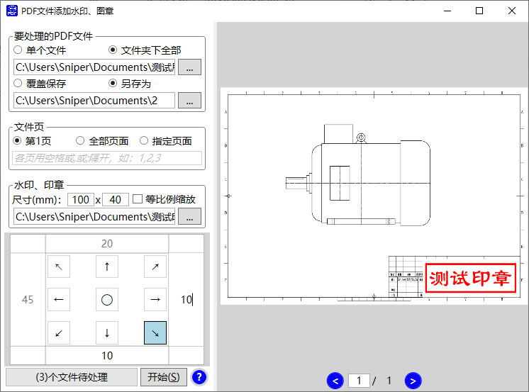

# PdfWaterMark（Pdf文件批量添加水印、图章）

## 项目介绍
Pdf文件批量添加水印、图章的工具，特别适合批量图纸盖LOGO。  

## 使用方法
  
  

## 关于本工具
本工具基于.Net 4.6的WPF框架，使用Visual Studio 2017开发。未使用经典的MVVM构架，简化为MV构架。  
开发中使用了如下开源库：  
+ Pdfium.Net
+ WindowsAPICodePack
如果你发现本程序有什么问题或好的建议，请与本人联系。我的邮箱是：liuweilhy@163.com  
by liuweilhy 2021年6月6日

## 项目源码及发行版下载
+ 源码下载（Gitee）：[https://gitee.com/liuweilhy/pdf-water-mark](https://gitee.com/liuweilhy/pdf-water-mark)
+ 发行版下载（Gitee），请选择最新版：[https://gitee.com/liuweilhy/pdf-water-mark/releases](https://gitee.com/liuweilhy/pdf-water-mark/releases)
